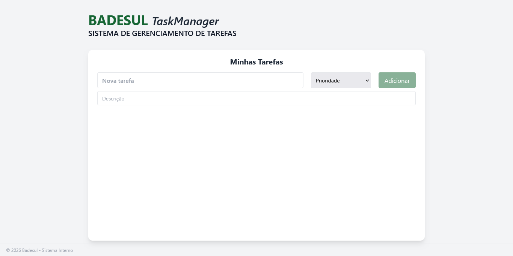
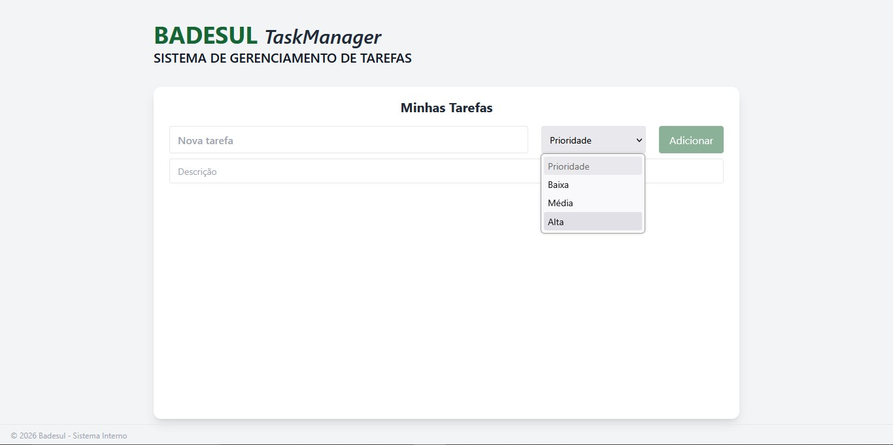
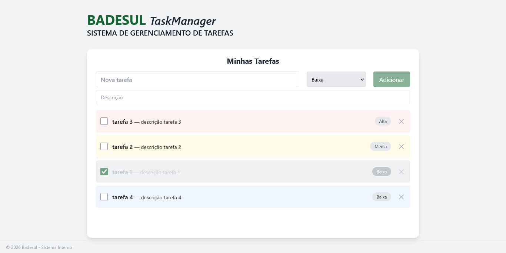
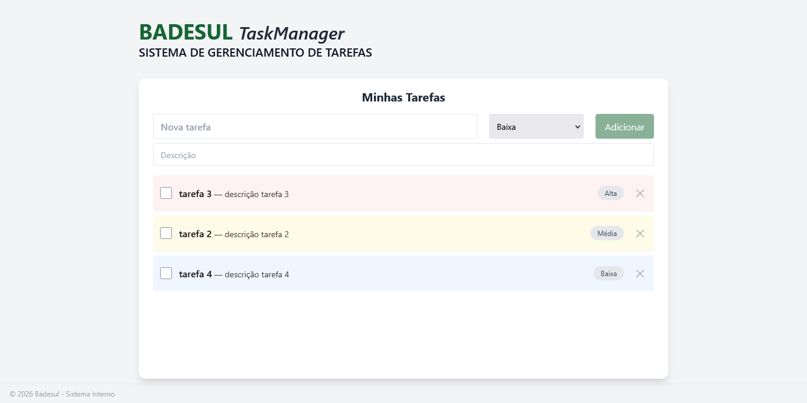
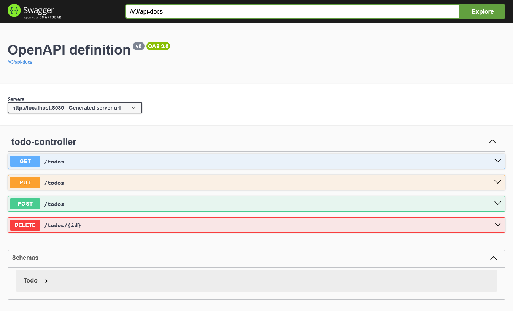
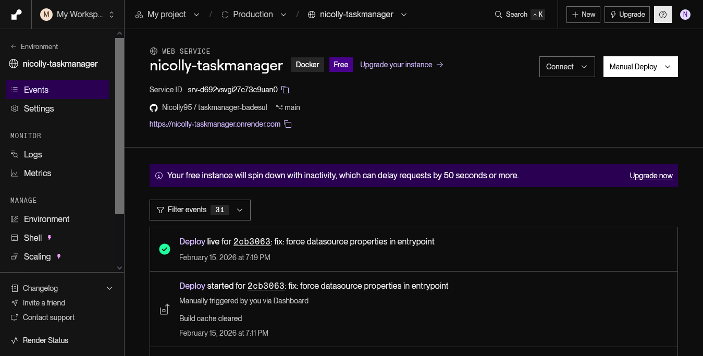

## TaskManager - Badesul
Sistema de gestão de tarefas desenvolvido para otimização de fluxos de trabalho, focado em performance e usabilidade.

## 🔗 [Deploy Live - Render](https://nicolly-taskmanager.onrender.com)

## 🚀 Tecnologias
- Backend: Java 17+ com Spring Boot 3.
- Frontend: * Vue.js 3 & Thymeleaf.
- Estilização: CSS3 / Tailwind CSS.
- Base de Dados: MySQL (via XAMPP) / H2.
- Segurança: Spring Security.
- Documentação: Swagger/OpenAPI.
- Infraestrutura: Docker & Render.

## 🏗️ Arquitetura
O projeto segue o padrão MVC (Model-View-Controller):
- Model: Mapeamento de entidades com Spring Data JPA.
- Service: Lógica de negócio e regras de validação.
- Controller: Gestão de rotas, endpoints REST e integração de templates.
- View: Interface reativa com Vue.js e renderização Thymeleaf.

## 🧪 Testes e Qualidade
O projeto foi desenvolvido seguindo boas práticas de qualidade:
- Testes Unitários: Implementados com JUnit 5 e Mockito para validar a camada de Service.
- Testes de Integração: Validação dos endpoints e da persistência de dados.
- Swagger UI: Documentação viva para testes manuais.

## 🛠️ Como Executar
1. Clonar o repositório:
git clone https://github.com/Nicolly95/taskmanager-badesul.git
2. Configurar o Banco de Dados:
Certifique-se de que o MySQL (XAMPP) está ativo.
3. Configurar o Backend:
- Importe o projeto como Maven na sua IDE.
- Execute a classe TaskmanagerApplication.java.
4. Acessar:
  Aplicação: http://localhost:8080
  Swagger: http://localhost:8080/swagger-ui/index.html

## ✨Funcionalidades
## 1. Visualização e Gestão Geral:
Interface principal onde é possível visualizar a lista de tarefas a ser preenchida.

## 2. Priorização de Tarefas:
Sistema de classificação de tarefas por níveis de prioridade (Alta, Média, Baixa) para melhor organização.

## 3. Conclusão de Tarefas:
Funcionalidade para marcar tarefas como finalizadas, mantendo o histórico de atividades concluídas.

## 4. Remoção de Tarefas:
Opção de exclusão de registros de forma simples e intuitiva.

## 5. Documentação

## 6. Deploy

